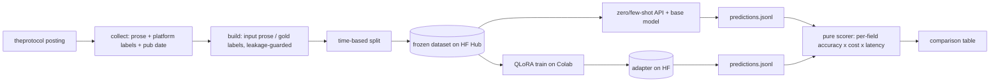

# pl-jobs-lora

**A QLoRA fine-tune of a small Polish LLM that turns Polish IT job-posting prose into structured
JSON — compared honestly against zero-shot / few-shot API baselines on accuracy × cost × latency.**

Portfolio project **P4** (stage 2). Given the free-text of a Polish IT job posting, the model
extracts a structured record — seniority, required/optional technologies, work mode, and salary —
as validated JSON. The dataset is **built from the sibling project [`it-job-radar`](https://github.com/P0w3r223/it-job-radar)**,
labeled with a triangulated QA loop, and every model variant is scored by one shared harness. The
argument the project makes: *a 1.5B model I fine-tuned myself can rival a frontier API on this narrow
task at a fraction of the cost — and here is the measurement.*

> Status: **in progress (session 5 of ~5) — full pipeline built; the training run is next.** The
> extraction contract, vendored normalization, config/tracking layer, and design decisions are built
> and tested; the base model is **chosen from data** — **Bielik-1.5B, few-shot** (see below); the
> **prose→JSON dataset is collected, leakage-guarded, and split by publication date**; the
> **labeling-QA triangulation**, the **S4 evaluation harness**, and the **S5 QLoRA trainer +
> inference** (Colab GPU, with all pure parts tested locally) are built (see below). What remains is
> *running* it: the paid API baseline and the QLoRA fine-tune on Colab, which populate the table.
> Evaluation numbers below are shown as an **empty shape**, not invented values.

## Why it's built this way

- **Own dataset, not Kaggle.** The training data comes from a pipeline that has been collecting
  Polish IT postings for months — data nobody else has. The model input is the posting *prose*; the
  labels are triangulated from the platform's own structured fields, an LLM reading only the prose,
  and human adjudication of the disagreements. See [ADR-0002](docs/decisions/0002-dataset-and-labeling.md).
- **Honest, apples-to-apples evaluation.** Every variant — zero-shot API, few-shot API, the untuned
  base, the QLoRA model — is scored by the **same pure, model-free harness** on the **same frozen
  test set**, per field. See [ADR-0003](docs/decisions/0003-evaluation-methodology.md).
- **Cost thinking, not just accuracy.** The report answers "per 1000 postings: API $X vs a
  fine-tuned model at ~$0 — at what accuracy?" — the question an employer actually asks.
- **A defensible base-model choice.** Bielik-1.5B vs Qwen2.5-1.5B was decided by an empirical probe,
  not reputation: on a 23-offer dev slice **Bielik-1.5B few-shot** won on JSON-validity × field
  accuracy (0.91 valid, 0.32 field F1) — and zero-shot Bielik emitting *no* valid JSON is exactly
  the gap QLoRA closes. See [ADR-0001](docs/decisions/0001-base-model-selection.md).

## Architecture



The **local `.venv`** builds the dataset, scores predictions, and runs the CPU base-model probe. The
**GPU/Linux training stack** (`transformers`/`peft`/`bitsandbytes`) lives in `requirements-train.txt`
and is installed **only on Colab** — the whole repo (dataset builder, harness, configs) is driven
locally; the Colab notebook only invokes its scripts. See [ADR-0004](docs/decisions/0004-training-infra.md).

## Install & test

```bash
python -m venv .venv
.venv/Scripts/python -m pip install -e ".[dev]"   # Windows; local deps only, no GPU stack
pytest        # offline: no models, no network
ruff check .
```

### Base-model probe (ADR-0001)

Selects the QLoRA base by running both candidates (Qwen2.5-1.5B, Bielik-1.5B) zero- and few-shot
over a live dev slice on **local CPU via GGUF**, scored by the pure harness:

```bash
# CPU llama.cpp: on Windows use the prebuilt wheel (no compiler needed)
.venv/Scripts/python -m pip install llama-cpp-python --prefer-binary \
  --extra-index-url https://abetlen.github.io/llama-cpp-python/whl/cpu

.venv/Scripts/python -m pl_jobs_lora.probe --collect   # fetch slice, then probe both models
.venv/Scripts/python -m pl_jobs_lora.probe             # replay cached slice
```

GGUFs download on demand; the slice, models, and per-run predictions/reports stay local (gitignored).
Both candidates use matched **Q8_0** quantization (Bielik ships no q4). Results land in
`results/probe/`; the decision and numbers are recorded in ADR-0001.

### Dataset build (ADR-0002)

Collects a bounded, throttled, spread sample of theprotocol offers, extracts **prose input** (titled
`jsonSections` only — the technologies widget is dropped as a label leak) + **platform-gold labels** +
publication date, filters the unusable, deduplicates reposts, and splits **by publication date**
(newest 20% → test) — never randomly:

```bash
.venv/Scripts/python -m pl_jobs_lora.dataset.run --collect --limit 20   # smoke: fetch 20, build, split
.venv/Scripts/python -m pl_jobs_lora.dataset.run --collect              # full ~800 collection + freeze
.venv/Scripts/python -m pl_jobs_lora.dataset.run                        # replay cached slice, rebuild
```

The collected slice and processed `data/processed/{train,test}.jsonl` + `manifest.json` stay local
(gitignored); freezing them on HF Hub (`--push`, needs `HF_TOKEN`) is deferred until the dataset repo
is provisioned. Everything downstream replays this frozen dataset — collect once, never re-scrape
(offers expire).

The current build: **800 offers fetched → 710 records** (90 reposts deduplicated by id and prose
hash), split **568 train / 142 test** by publication date. Label coverage: title & work-mode 100%,
seniority 99%, expected-tech 76%, salary 31% (salary is honestly sparse — often absent from the
posting). Zero prose leaks the technologies widget (leakage guard). Cross-split leakage is prevented
by the **dedupe-before-split** ordering: train and test share **no offer id** and **no prose hash**.
The temporal cut is by publication date (train older, test newest); in this build it falls cleanly
between two postings ~14 min apart.

### Labeling QA (ADR-0005)

Before trusting the platform-gold labels, S3 triangulates three independent label sources and reports
their agreement. A local **Bielik-1.5B few-shot** proposer relabels every posting **from prose only**
(a small-model *prose-recoverability floor*, not a quality claim); its labels are compared to the
platform gold at full scale. A seeded, **disagreement-stratified 72-record sample** is then drawn for
human adjudication, and a distinct API arbiter (`claude-opus-4-8`) pre-fills each sample so the human
corrects contested cells instead of labeling from a blank form:

```bash
.venv/Scripts/python -m pl_jobs_lora.dataset.labeling_qa --propose   # Bielik few-shot over the set
.venv/Scripts/python -m pl_jobs_lora.dataset.labeling_qa --sample     # seeded, stratified queue
.venv/Scripts/python -m pl_jobs_lora.dataset.labeling_qa --arbiter    # pre-fill via the API arbiter
#     -> hand-adjudicate every contested cell, save as results/labeling_qa/human_gold.jsonl
.venv/Scripts/python -m pl_jobs_lora.dataset.labeling_qa --report     # agreement + triangulation
```

The report gives raw agreement, per-field F1 (reused scorer), and **Cohen's κ** for the categorical
fields, plus a per-field **triangulation** bucketing each cell into *all-agree / platform-gap-caught
(LLM==human≠platform) / LLM-error (platform==human≠LLM) / all-differ*. The agreement math
(`dataset/agreement.py`) and the sampler are **pure and offline**; only `dataset/labeling_qa.py`
touches the model, the network, and files. Proposals, the review queue, and human gold echo prose and
are **never committed** — only the numbers-only `results/labeling_qa/report.{json,md}` is versioned.
Egress is a single point, hard-capped at ≤80 PII-free prose snippets to the arbiter; the Anthropic
client is an optional `api` extra imported lazily, so the core install, tests, and CI stay offline
(CI exercises the agreement layer on synthetic `data/fixtures/labeling_qa/` only).

### Evaluation — API baselines + comparison report (ADR-0003)

S4 completes the `eval/` module: the **zero-/few-shot API baselines** and the **comparison report**
that scores every variant on accuracy × cost × latency. The baseline API model is a cheap frontier
model (`claude-haiku-4-5`); it reuses the **same prompt as the probe** and generates **plain text**
(not a forced tool call), so JSON validity stays a first-class metric the model can fail — the only
variable across variants is the model.

```bash
.venv/Scripts/python -m pl_jobs_lora.eval.run --baselines   # zero-/few-shot over test set (paid, network)
.venv/Scripts/python -m pl_jobs_lora.eval.run --report      # score every predictions file (offline)
```

`--baselines` runs the frozen test set through the API and writes
`results/eval/predictions/{model}__{mode}.jsonl` (per-call token counts + latency); it needs
`ANTHROPIC_API_KEY` and the optional `api` extra. `--report` is **pure and offline**: it scores each
predictions file with the ADR-0003 scorer, folds in API cost (tokens × list price, pulled from
`config.yaml`) and p50/p95 latency, and writes the numbers-only `results/eval/report.{json,md}`.
Variants without token counts — the local base/LoRA/GGUF runs (~$0 marginal) — report no cost, so the
same report merges the API baselines with predictions dropped in later from Colab. Predictions echo
prose and are **never committed**; only the report is versioned. Egress is hard-capped at
`eval.request_max_snippets` per run, and the Anthropic client is imported lazily (`api` extra), so the
core install, tests, and CI stay fully offline. The report answers the headline question: *does a 1.5B
local LoRA rival a frontier API on this task at a fraction of the cost/latency?*

### Training — QLoRA fine-tune on Colab (ADR-0006)

S5 fine-tunes Bielik-1.5B with QLoRA and produces the base/adapter predictions that complete the
table. The method: **zero-shot completion SFT** — each record is *exactly* the zero-shot eval prompt
with the gold JSON as the target, prompt tokens masked so the model trains only on the JSON (learning
the stop token that the base model, which rambles, lacks). LoRA over **all linear layers**
(r=16/α=32, NF4 4-bit); an **inner temporal dev split** (newest ~10% of train) governs checkpoint
selection so the **142-record test set is scored exactly once** — the fairness guard, since the API
baselines get no tuning. Salary is honestly a data-availability ceiling (the leakage guard keeps it
out of the prose the model sees), so `tech_expected` F1 is the metric to watch.

Training needs a **Linux GPU** (bitsandbytes has no Windows/CPU build), so it runs on Colab via
[`notebooks/train_qlora.ipynb`](notebooks/train_qlora.ipynb); the GPU stack lives in
`requirements-train.txt` and is installed **only there** (ADR-0004). The whole repo is driven from
the notebook — it only invokes these scripts:

```bash
# on Colab (GPU), after `pip install -r requirements-train.txt`:
python -m pl_jobs_lora.train.qlora --push                 # fine-tune; push the adapter to HF
python -m pl_jobs_lora.inference.predict_hf --base --lora  # base (adapter off) + LoRA predictions
python -m pl_jobs_lora.eval.run --report                   # merge every variant into the table
```

`predict_hf` reuses the shared prompt + parser + greedy decoding (token cap = `eval.max_tokens`), and
loads the base and the adapter from the *same* 4-bit weights with only the adapter toggled — so the
adapter-vs-base comparison isolates one variable. Its predictions carry no token counts, so the report
prices them at ~$0 (local). The pure parts — SFT formatting, the temporal dev split, completion
masking — are tested on the local CPU `.venv`; the GPU orchestration is exercised only on Colab.
`inference/predict_gguf.py` optionally times the base on **local CPU via GGUF** for the latency column
(the adapter is not GGUF-converted). See [ADR-0006](docs/decisions/0006-qlora-training-method.md).

## Evaluation (shape — populated in later sessions)

| Variant | JSON valid | Seniority F1 | Tech F1 | Work-mode F1 | Salary acc | Median cost | Median latency |
|---|---|---|---|---|---|---|---|
| zero-shot (API) | – | – | – | – | – | – | – |
| few-shot (API) | – | – | – | – | – | – | – |
| base (untuned) | – | – | – | – | – | – | – |
| **QLoRA (ours)** | – | – | – | – | – | – | – |

Metrics normalize both sides through the vendored it-job-radar functions (alias- and
Polish-quirk-aware), so the comparison is fair rather than penalizing paraphrases.

## Data & ethics

Raw postings are **never committed**: prose is captured at collection time (theprotocol postings
expire and the site strips pages for datacenter IPs), the processed dataset is frozen on HF Hub, and
only prose-derived fields leave the machine. Personal data (the `applying` block) is dropped.
Collection is a bounded, throttled sample — never the whole base. Attribution: theprotocol.it, reused
via `it-job-radar`.

## Design decisions

- [ADR-0001 — base-model selection by empirical probe](docs/decisions/0001-base-model-selection.md)
- [ADR-0002 — dataset construction + triangulated labeling QA](docs/decisions/0002-dataset-and-labeling.md)
- [ADR-0003 — per-field metrics with a pure scorer](docs/decisions/0003-evaluation-methodology.md)
- [ADR-0004 — Colab training, hosted MLflow, HF Hub artifacts](docs/decisions/0004-training-infra.md)
- [ADR-0005 — labeling-QA: adjudication authority + the proposer instrument](docs/decisions/0005-labeling-qa-architecture.md)
- [ADR-0006 — QLoRA training method: zero-shot completion SFT of Bielik-1.5B](docs/decisions/0006-qlora-training-method.md)
- [F6 — data-availability verdict](docs/research/f6-data-availability.md)

## License

MIT — see [LICENSE](LICENSE).
