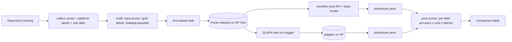

# pl-jobs-lora

**Polish IT job ads to structured JSON: API baselines, a data ceiling, and a QLoRA pipeline whose
fine-tune has not been run yet.**

Given the free text of a Polish IT job posting, a model extracts seniority, required and optional
technologies, work mode and salary as validated JSON. The dataset is built from the sibling project
[it-job-radar](https://github.com/P0w3r223/it-job-radar), and every variant is scored by one shared
harness with bootstrap confidence intervals on a 142-posting test set.

The labels are hard to learn from the text alone. Salary appears in only 35 of the 142 test postings,
the gold labels come from a platform field that has to be removed from the model's input, and one
field (`tech_optional`) is not recoverable from the posting at all.

| Few-shot, 142 test postings | Field F1 |
|---|---|
| `claude-haiku-4-5` (API) | 0.51 |
| Bielik-1.5B, quantised, local CPU, not fine-tuned | 0.30 |

> **Status: in progress.** The baselines are measured end to end. The QLoRA trainer and inference
> code are built and their pure parts are tested; the fine-tune needs a hosted GPU and has not been
> run. **[Live page](https://p0w3r223.github.io/pl-jobs-lora/)**

## Why it's built this way

- **Own dataset, not Kaggle.** The training data comes from a pipeline that has been collecting
  Polish IT postings for months — data nobody else has. The model input is the posting *prose*; the
  labels are triangulated from the platform's own structured fields, an LLM reading only the prose,
  and human adjudication of the disagreements. See [ADR-0002](docs/decisions/0002-dataset-and-labeling.md).
- **Honest, apples-to-apples evaluation.** Every variant — zero-shot API, few-shot API, the untuned
  base, the QLoRA model — is scored by the **same pure, model-free harness** on the **same frozen
  test set**, per field. See [ADR-0003](docs/decisions/0003-evaluation-methodology.md).
- **Cost thinking, not just accuracy.** The report answers "per 1000 postings: API $X vs a
  fine-tuned model at ~$0 — at what accuracy?" — the question an employer actually asks.
- **A defensible base-model choice.** Bielik-1.5B vs Qwen2.5-1.5B was decided by an empirical probe,
  not reputation: on a 23-offer dev slice **Bielik-1.5B few-shot** won on JSON-validity × field
  accuracy (0.91 valid, 0.42 field F1) — and zero-shot Bielik emitting *no* valid JSON is exactly
  the gap QLoRA closes. See [ADR-0001](docs/decisions/0001-base-model-selection.md).

## Architecture



The **local `.venv`** builds the dataset, scores predictions, and runs the CPU base-model probe. The
**GPU/Linux training stack** (`transformers`/`peft`/`bitsandbytes`) lives in `requirements-train.txt`
and is installed **only on the hosted GPU** — the whole repo (dataset builder, harness, configs) is
driven locally; the notebook only invokes its scripts. See [ADR-0004](docs/decisions/0004-training-infra.md).

## Install & test

```bash
python -m venv .venv
.venv/Scripts/python -m pip install -e ".[dev]"   # Windows; local deps only, no GPU stack
pytest        # offline: no models, no network
ruff check .
```

Each stage (base-model probe, dataset build, labeling QA, evaluation, training) with its commands: [docs/pipeline.md](docs/pipeline.md).

## Evaluation (partial — local + API rows in, GPU rows pending)

Numbers below are the current `results/eval/report.md`, regenerated by `eval.run --report` as each
variant's predictions land. The two GGUF rows are the **CPU-latency variant of the untuned base**
(Q8_0, `predict_gguf.py`, full 142-item test set) — the "runs on a laptop" cost story, not the
apples-to-apples comparison; the **canonical** base/LoRA rows (HF 4-bit, same weights, adapter
toggled) drop in from the hosted GPU (S5) below.

| variant | cov | JSON valid | seniority F1 | tech F1 | work-mode F1 | salary detect | salary cur/kind/amt | field F1 | $/1k | p50 s | p95 s |
|---|---|---|---|---|---|---|---|---|---|---|---|
| bielik-1.5b-gguf__few | 1.00 | 0.80 | 0.25 | 0.12 | 0.54 | 0.61 | 0.00/0.00/0.00 | 0.30 | – | 21.43 | 103.02 |
| bielik-1.5b-gguf__zero | 1.00 | 0.05 | 0.07 | 0.01 | 0.05 | 0.03 | 0.03/0.00/0.00 | 0.04 | – | 67.90 | 102.58 |
| claude-haiku-4-5__zero | 1.00 | 1.00 | 0.44 | 0.26 | 0.60 | 0.77 | 0.23/0.11/0.06 | 0.43 | 3.34 | 2.47 | 4.68 |
| claude-haiku-4-5__few | 1.00 | 1.00 | 0.62 | 0.28 | 0.63 | 0.78 | 0.23/0.11/0.06 | **0.51** | 4.47 | 2.25 | 4.13 |
| bielik-1.5b__zero (base, HF 4-bit) | – | – | – | – | – | – | – | – | – | – | – |
| **bielik-1.5b-lora__zero (QLoRA, ours)** | – | – | – | – | – | – | – | – | – | – | – |

`cov` is the fraction of the 142-item gold set the variant actually predicted: a run that dies
part-way now scores only its own subset and says so, instead of rendering as a complete run.
Metrics normalize both sides through the vendored it-job-radar functions (alias- and
Polish-quirk-aware), so the comparison is fair rather than penalizing paraphrases.

A salary-scoring bug inflated results published before 2026-08-18; what broke and how it was fixed: [docs/correction-2026-08-18.md](docs/correction-2026-08-18.md).

### Why a variant failed, not just how often

`JSON valid` counts failures; it never says what they were. A run at 0.05 validity could be a model
that emits no JSON at all or one whose JSON the schema rejects — a different diagnosis and a
different fix. The parser now records a **failure class** per prediction alongside the raw output,
and the report tabulates them:

| class | meaning |
|---|---|
| `empty_output` | the model returned nothing |
| `no_json_object` | prose only — no `{` anywhere |
| `json_decode_error` | a `{` that never closes; usually a hit token cap |
| `schema_invalid` | an object the `JobPosting` contract rejects |
| `unrecorded` | written before the taxonomy existed — reason unrecoverable |

The report cross-tabs `json_decode_error` against the decoding cap, which separates *truncated*
from *malformed* — the confound the validity rate cannot resolve on its own. **The four prediction
files currently on disk predate this**, so all 164 of their invalid rows report `unrecorded`: the
harness can diagnose the next run, not the last one. Re-running the two local GGUF variants would
backfill them at no cost beyond CPU time (~3.5 h, no API spend); the API rows would have to be
re-paid.

### The data ceiling: how much of the label is even in the input

`tech_optional` scored 0.01–0.02 for *every* variant, including the frontier baseline. A metric on
which the best available model does no better than the worst is usually not measuring the model.
Three independent checks agree it was not:

- The labeling-QA proposer, reading **prose only** across 708 postings, produced a non-empty
  `tech_optional` on **27** records — against 575 for `tech_expected`.
- `claude-haiku-4-5` *does* attempt the field (36 records against a support of 53) and reaches
  precision **0.03**, while scoring 0.29 on `tech_expected` in the same call.
- Model-free, searching the text itself: only **14–17 %** of gold `tech_optional` terms occur
  anywhere in their own posting's prose, and **75 %** of postings carrying gold optional terms
  contain not one of them. For `tech_expected`: 32–35 % and 36 %.

The cause is a design decision whose size was never measured. Gold tech labels come from the
platform's technologies widget, and the [ADR-0002](docs/decisions/0002-dataset-and-labeling.md)
leakage guard strips that widget out of the prose so the task is reading rather than copying. The
labels it makes unanswerable stayed in the metric anyway.

So `field F1` now averages `seniority`, `work_mode` and `tech_expected`. `tech_optional` is still
scored and reported — beside its own ceiling — but is not treated as evidence about a model. And
`--report` prints a **model-free data ceiling**: per field, the share of gold terms present in the
prose at all.

**This changes how the headline reads.** On the test set the ceiling for `tech_expected` is `0.28`
and the best recall achieved is `0.27` — the frontier baseline is at **94 % of what the input makes
recoverable**. Without the ceiling, 0.28 F1 looks like a weak model; with it, the headroom on that
field is mostly not there to be taken. It also sets honest expectations for the fine-tune: the open
ground is `JSON validity` (0.05 zero-shot), `seniority` and `work_mode` — `tech_*` is near a data
ceiling no QLoRA can lift.

The ceiling is a **bound, not a target** (presence is necessary for extraction, not sufficient) and
matching is deliberately conservative, so read it as a floor on the ceiling.

### How much of the gap is real (n = 142)

A point estimate over 142 records cannot say whether `0.51` beats `0.30` or whether a different
sample of postings would have reversed it. `--report` now resamples the test set (2000 draws,
seeded) and reports a 95 % interval per variant, plus **paired** differences against the best
variant — every variant scored on the *same* drawn records, so the shared difficulty of a draw
cancels rather than inflating both sides. Two overlapping per-variant CIs can still produce a
separated paired difference; that is exactly why the comparison is paired and not eyeballed.

On the current four rows every gap survives resampling except one: the two Haiku variants are
identical on JSON validity (both 1.00), and the report says `separated: no` rather than dressing a
tie as a finding. Few-shot's `+0.06` field F1 over zero-shot **is** separated — a real effect, not
sampling noise. `--no-bootstrap` skips the section; the resampling dominates the runtime (~8 s).

**Pending (compute run, not code):**
- QLoRA train + canonical base/LoRA predictions — Kaggle GPU:
  `notebooks/train_qlora.ipynb` (Step-0 measure `max_seq_len`, train, push adapter, `predict_hf --base --lora`)
- After that lands: `.venv/Scripts/python -m pl_jobs_lora.eval.run --report` regenerates this table.

**Known gaps in this harness:**
- The local side is priced `–` rather than as a number, so the cost comparison is rhetorical until
  the fine-tune gives real GPU throughput.
- The bootstrap covers `field F1` and `JSON valid` only — the per-field and salary columns are
  still bare point estimates.
- The data ceiling is computed for the two tech fields only; `seniority`, `work_mode` and `salary`
  have no comparable answerability bound, so their scores are still read without one.

## Data & ethics

Raw postings are **never committed**: prose is captured at collection time (theprotocol postings
expire and the site strips pages for datacenter IPs), the processed dataset stays local until its
Hub repository is provisioned, and only prose-derived fields leave the machine. Personal data (the `applying` block) is dropped.
Collection is a bounded, throttled sample — never the whole base. Attribution: theprotocol.it, reused
via `it-job-radar`.

## Design decisions

- [ADR-0001 — base-model selection by empirical probe](docs/decisions/0001-base-model-selection.md)
- [ADR-0002 — dataset construction + triangulated labeling QA](docs/decisions/0002-dataset-and-labeling.md)
- [ADR-0003 — per-field metrics with a pure scorer](docs/decisions/0003-evaluation-methodology.md)
- [ADR-0004 — hosted-GPU training, hosted MLflow, HF Hub artifacts (amended: Kaggle, not Colab)](docs/decisions/0004-training-infra.md)
- [ADR-0005 — labeling-QA: adjudication authority + the proposer instrument](docs/decisions/0005-labeling-qa-architecture.md)
- [ADR-0006 — QLoRA training method: zero-shot completion SFT of Bielik-1.5B](docs/decisions/0006-qlora-training-method.md)
- [F6 — data-availability verdict](docs/research/f6-data-availability.md)

## License

MIT — see [LICENSE](LICENSE).
