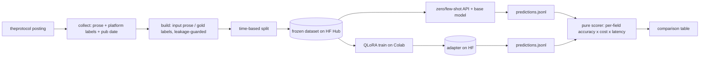

# pl-jobs-lora

**A QLoRA fine-tune of a small Polish LLM that turns Polish IT job-posting prose into structured
JSON — compared honestly against zero-shot / few-shot API baselines on accuracy × cost × latency.**

Portfolio project **P4** (stage 2). Given the free-text of a Polish IT job posting, the model
extracts a structured record — seniority, required/optional technologies, work mode, and salary —
as validated JSON. The dataset is **built from the sibling project [`it-job-radar`](https://github.com/P0w3r223/it-job-radar)**,
labeled with a triangulated QA loop, and every model variant is scored by one shared harness. The
argument the project makes: *a 1.5B model I fine-tuned myself can rival a frontier API on this narrow
task at a fraction of the cost — and here is the measurement.*

> Status: **in progress — baselines measured, fine-tune pending.** The extraction contract, vendored
> normalization, config/tracking layer, and design decisions are built and tested; the base model is
> **chosen from data** — **Bielik-1.5B, few-shot** (see below); the **prose→JSON dataset is collected,
> leakage-guarded, and split by publication date**; the **labeling-QA triangulation**, the **S4
> evaluation harness**, and the **S5 QLoRA trainer + inference** (Colab GPU, with all pure parts tested
> locally) are built. **Run so far:** the labeling-QA proposer (708/710 postings relabeled from prose)
> and its human-review queue draw; the untuned base's **local CPU (GGUF) predictions on the full
> 142-item test set**; and the **`claude-haiku-4-5` API baseline** — both shot modes each, so **four of
> the six rows below are real measurements**, reported with bootstrap confidence intervals. What
> remains is compute outside this environment: the labeling-QA arbiter + human adjudication, and the
> QLoRA fine-tune itself — see "Pending" under Evaluation and under Labeling QA below.
>
> One published result was **retracted and corrected** along the way; the correction is written up
> rather than quietly restated, under "Correction" below.

## Why it's built this way

- **Own dataset, not Kaggle.** The training data comes from a pipeline that has been collecting
  Polish IT postings for months — data nobody else has. The model input is the posting *prose*; the
  labels are triangulated from the platform's own structured fields, an LLM reading only the prose,
  and human adjudication of the disagreements. See [ADR-0002](docs/decisions/0002-dataset-and-labeling.md).
- **Honest, apples-to-apples evaluation.** Every variant — zero-shot API, few-shot API, the untuned
  base, the QLoRA model — is scored by the **same pure, model-free harness** on the **same frozen
  test set**, per field. See [ADR-0003](docs/decisions/0003-evaluation-methodology.md).
- **Cost thinking, not just accuracy.** The report answers "per 1000 postings: API $X vs a
  fine-tuned model at ~$0 — at what accuracy?" — the question an employer actually asks.
- **A defensible base-model choice.** Bielik-1.5B vs Qwen2.5-1.5B was decided by an empirical probe,
  not reputation: on a 23-offer dev slice **Bielik-1.5B few-shot** won on JSON-validity × field
  accuracy (0.91 valid, 0.42 field F1) — and zero-shot Bielik emitting *no* valid JSON is exactly
  the gap QLoRA closes. See [ADR-0001](docs/decisions/0001-base-model-selection.md).

## Architecture



The **local `.venv`** builds the dataset, scores predictions, and runs the CPU base-model probe. The
**GPU/Linux training stack** (`transformers`/`peft`/`bitsandbytes`) lives in `requirements-train.txt`
and is installed **only on Colab** — the whole repo (dataset builder, harness, configs) is driven
locally; the Colab notebook only invokes its scripts. See [ADR-0004](docs/decisions/0004-training-infra.md).

## Install & test

```bash
python -m venv .venv
.venv/Scripts/python -m pip install -e ".[dev]"   # Windows; local deps only, no GPU stack
pytest        # offline: no models, no network
ruff check .
```

### Base-model probe (ADR-0001)

Selects the QLoRA base by running both candidates (Qwen2.5-1.5B, Bielik-1.5B) zero- and few-shot
over a live dev slice on **local CPU via GGUF**, scored by the pure harness:

```bash
# CPU llama.cpp: on Windows use the prebuilt wheel (no compiler needed)
.venv/Scripts/python -m pip install llama-cpp-python --prefer-binary \
  --extra-index-url https://abetlen.github.io/llama-cpp-python/whl/cpu

.venv/Scripts/python -m pl_jobs_lora.probe --collect   # fetch slice, then probe both models
.venv/Scripts/python -m pl_jobs_lora.probe             # replay cached slice
.venv/Scripts/python -m pl_jobs_lora.probe --rescore   # re-score stored predictions (no model)
```

GGUFs download on demand; the slice, models, and per-run predictions/reports stay local (gitignored).
Both candidates use matched **Q8_0** quantization (Bielik ships no q4). Results land in
`results/probe/`; the decision and numbers are recorded in ADR-0001.

`--rescore` is the probe's counterpart to `eval.run --report`: it re-scores the **stored**
predictions with the current scorer, offline and without loading a model, so a change to the
metrics can be propagated to the published probe numbers without re-paying for inference. It was
added when the scoring correction below invalidated the salary columns of the ADR-0001 table — see
that ADR's 2026-08-21 amendment.

### Dataset build (ADR-0002)

Collects a bounded, throttled, spread sample of theprotocol offers, extracts **prose input** (titled
`jsonSections` only — the technologies widget is dropped as a label leak) + **platform-gold labels** +
publication date, filters the unusable, deduplicates reposts, and splits **by publication date**
(newest 20% → test) — never randomly:

```bash
.venv/Scripts/python -m pl_jobs_lora.dataset.run --collect --limit 20   # smoke: fetch 20, build, split
.venv/Scripts/python -m pl_jobs_lora.dataset.run --collect              # full ~800 collection + freeze
.venv/Scripts/python -m pl_jobs_lora.dataset.run                        # replay cached slice, rebuild
```

The collected slice and processed `data/processed/{train,test}.jsonl` + `manifest.json` stay local
(gitignored); freezing them on HF Hub (`--push`, needs `HF_TOKEN`) is deferred until the dataset repo
is provisioned. Everything downstream replays this frozen dataset — collect once, never re-scrape
(offers expire).

The current build: **800 offers fetched → 710 records** (90 reposts deduplicated by id and prose
hash), split **568 train / 142 test** by publication date. Label coverage: title & work-mode 100%,
seniority 99%, expected-tech 76%, salary 31% (salary is honestly sparse — often absent from the
posting). Zero prose leaks the technologies widget (leakage guard). Cross-split leakage is prevented
by the **dedupe-before-split** ordering: train and test share **no offer id** and **no prose hash**.
The temporal cut is by publication date (train older, test newest); in this build it falls cleanly
between two postings ~14 min apart.

### Labeling QA (ADR-0005)

Before trusting the platform-gold labels, S3 triangulates three independent label sources and reports
their agreement. A local **Bielik-1.5B few-shot** proposer relabels every posting **from prose only**
(a small-model *prose-recoverability floor*, not a quality claim); its labels are compared to the
platform gold at full scale. A seeded, **disagreement-stratified 72-record sample** is then drawn for
human adjudication, and a distinct API arbiter (`claude-opus-4-8`) pre-fills each sample so the human
corrects contested cells instead of labeling from a blank form:

```bash
.venv/Scripts/python -m pl_jobs_lora.dataset.labeling_qa --propose   # Bielik few-shot over the set
.venv/Scripts/python -m pl_jobs_lora.dataset.labeling_qa --sample     # seeded, stratified queue
.venv/Scripts/python -m pl_jobs_lora.dataset.labeling_qa --arbiter    # pre-fill via the API arbiter
#     -> hand-adjudicate every contested cell, save as results/labeling_qa/human_gold.jsonl
.venv/Scripts/python -m pl_jobs_lora.dataset.labeling_qa --report     # agreement + triangulation
```

The report gives raw agreement, per-field F1 (reused scorer), and **Cohen's κ** for the categorical
fields, plus a per-field **triangulation** bucketing each cell into *all-agree / platform-gap-caught
(LLM==human≠platform) / LLM-error (platform==human≠LLM) / all-differ*. The agreement math
(`dataset/agreement.py`) and the sampler are **pure and offline**; only `dataset/labeling_qa.py`
touches the model, the network, and files. Proposals, the review queue, and human gold echo prose and
are **never committed** — only the numbers-only `results/labeling_qa/report.{json,md}` is versioned.
Egress is a single point, hard-capped at ≤80 PII-free prose snippets to the arbiter; the Anthropic
client is an optional `api` extra imported lazily, so the core install, tests, and CI stay offline
(CI exercises the agreement layer on synthetic `data/fixtures/labeling_qa/` only).

**Run status:** `--propose` and `--sample` have been run — 708/710 postings relabeled from prose, and
the seeded 72-record review queue is drawn. **Pending:** `--arbiter` (paid API) and the human
adjudication pass, then `--report`; all three are compute/manual steps outside this environment, not
code.

### Evaluation — API baselines + comparison report (ADR-0003)

S4 completes the `eval/` module: the **zero-/few-shot API baselines** and the **comparison report**
that scores every variant on accuracy × cost × latency. The baseline API model is a cheap frontier
model (`claude-haiku-4-5`); it reuses the **same prompt as the probe** and generates **plain text**
(not a forced tool call), so JSON validity stays a first-class metric the model can fail — the only
variable across variants is the model.

```bash
.venv/Scripts/python -m pl_jobs_lora.eval.run --baselines   # zero-/few-shot over test set (paid, network)
.venv/Scripts/python -m pl_jobs_lora.eval.run --report      # score every predictions file (offline)
.venv/Scripts/python -m pl_jobs_lora.eval.run --report --no-bootstrap   # skip the resampling section
```

`--baselines` runs the frozen test set through the API and writes
`results/eval/predictions/{model}__{mode}.jsonl` (per-call token counts + latency); it needs
`ANTHROPIC_API_KEY` and the optional `api` extra. `--report` is **pure and offline**: it scores each
predictions file with the ADR-0003 scorer, folds in API cost (tokens × list price, pulled from
`config.yaml`) and p50/p95 latency, and writes the numbers-only `results/eval/report.{json,md}`.
Variants without token counts — the local base/LoRA/GGUF runs (~$0 marginal) — report no cost, so the
same report merges the API baselines with predictions dropped in later from Colab. Predictions echo
prose and are **never committed**; only the report is versioned. Egress is hard-capped at
`eval.request_max_snippets` per run, and the Anthropic client is imported lazily (`api` extra), so the
core install, tests, and CI stay fully offline. The report answers the headline question: *does a 1.5B
local LoRA rival a frontier API on this task at a fraction of the cost/latency?*

Beyond the accuracy table, `--report` emits two sections that keep that answer interpretable: a
**failure taxonomy** (why each invalid prediction was invalid, with truncation separated from
malformed JSON) and **bootstrap intervals** with paired variant differences, so a gap on 142 records
is only called real when it survives resampling. Both are pure and offline; both are described under
Evaluation below and in [ADR-0003](docs/decisions/0003-evaluation-methodology.md).

### Training — QLoRA fine-tune on Colab (ADR-0006)

S5 fine-tunes Bielik-1.5B with QLoRA and produces the base/adapter predictions that complete the
table. The method: **zero-shot completion SFT** — each record is *exactly* the zero-shot eval prompt
with the gold JSON as the target, prompt tokens masked so the model trains only on the JSON (learning
the stop token that the base model, which rambles, lacks). LoRA over **all linear layers**
(r=16/α=32, NF4 4-bit); an **inner temporal dev split** (newest ~10% of train) governs checkpoint
selection so the **142-record test set is scored exactly once** — the fairness guard, since the API
baselines get no tuning. Salary is honestly a data-availability ceiling (the leakage guard keeps it
out of the prose the model sees), so `tech_expected` F1 is the metric to watch.

Training needs a **Linux GPU** (bitsandbytes has no Windows/CPU build), so it runs on Colab via
[`notebooks/train_qlora.ipynb`](notebooks/train_qlora.ipynb); the GPU stack lives in
`requirements-train.txt` and is installed **only there** (ADR-0004). The whole repo is driven from
the notebook — it only invokes these scripts:

```bash
# on Colab (GPU), after `pip install -r requirements-train.txt`:
python -m pl_jobs_lora.train.qlora --push                 # fine-tune; push the adapter to HF
python -m pl_jobs_lora.inference.predict_hf --base --lora  # base (adapter off) + LoRA predictions
python -m pl_jobs_lora.eval.run --report                   # merge every variant into the table
```

`predict_hf` reuses the shared prompt + parser + greedy decoding (token cap = `eval.max_tokens`), and
loads the base and the adapter from the *same* 4-bit weights with only the adapter toggled — so the
adapter-vs-base comparison isolates one variable. Its predictions carry no token counts, so the report
prices them at ~$0 (local). The pure parts — SFT formatting, the temporal dev split, completion
masking — are tested on the local CPU `.venv`; the GPU orchestration is exercised only on Colab.
`inference/predict_gguf.py` optionally times the base on **local CPU via GGUF** for the latency column
(the adapter is not GGUF-converted). See [ADR-0006](docs/decisions/0006-qlora-training-method.md).

## Evaluation (partial — local + API rows in, Colab rows pending)

Numbers below are the current `results/eval/report.md`, regenerated by `eval.run --report` as each
variant's predictions land. The two GGUF rows are the **CPU-latency variant of the untuned base**
(Q8_0, `predict_gguf.py`, full 142-item test set) — the "runs on a laptop" cost story, not the
apples-to-apples comparison; the **canonical** base/LoRA rows (HF 4-bit, same weights, adapter
toggled) drop in from Colab (S5) below.

| variant | cov | JSON valid | seniority F1 | tech F1 | work-mode F1 | salary detect | salary cur/kind/amt | field F1 | $/1k | p50 s | p95 s |
|---|---|---|---|---|---|---|---|---|---|---|---|
| bielik-1.5b-gguf__few | 1.00 | 0.80 | 0.25 | 0.12 | 0.54 | 0.61 | 0.00/0.00/0.00 | 0.30 | – | 21.4 | 103.0 |
| bielik-1.5b-gguf__zero | 1.00 | 0.05 | 0.07 | 0.01 | 0.05 | 0.03 | 0.03/0.00/0.00 | 0.04 | – | 67.9 | 102.6 |
| claude-haiku-4-5__zero | 1.00 | 1.00 | 0.44 | 0.26 | 0.60 | 0.77 | 0.23/0.11/0.06 | 0.43 | 3.34 | 2.5 | 4.7 |
| claude-haiku-4-5__few | 1.00 | 1.00 | 0.62 | 0.28 | 0.63 | 0.78 | 0.23/0.11/0.06 | **0.51** | 4.47 | 2.3 | 4.1 |
| bielik-1.5b__zero (base, HF 4-bit) | – | – | – | – | – | – | – | – | – | – | – |
| **bielik-1.5b-lora__zero (QLoRA, ours)** | – | – | – | – | – | – | – | – | – | – | – |

`cov` is the fraction of the 142-item gold set the variant actually predicted: a run that dies
part-way now scores only its own subset and says so, instead of rendering as a complete run.
Metrics normalize both sides through the vendored it-job-radar functions (alias- and
Polish-quirk-aware), so the comparison is fair rather than penalizing paraphrases.

### Correction: the salary numbers published before 2026-08-18 were wrong

The earlier scorer credited `None == None`, and **107 of 142 gold records carry no salary**. A model
emitting nothing at all therefore inherited that base rate: the previous table reported
`bielik-1.5b-gguf__zero` at **0.75/0.87/0.74 on salary while producing valid JSON 4.9 % of the
time**. That number measured the prevalence of missing salaries, not accuracy.

The metric is now split, and both halves are denominated honestly:

- **`salary detect`** — the present/absent decision, over all 142 records. Correctly answering
  "no salary" is a real answer and is credited here.
- **`salary cur/kind/amt`** — accuracy over the **35** records whose gold *has* a salary. Predicting
  nothing earns nothing.

The corrected picture is much worse and much more informative: even the frontier baseline recovers
the currency on 23 % of the salaries present, the arrangement on 11 %, and the amount bounds on
**6 %**. Salary extraction is the weakest part of this task by a wide margin, which the old metric
hid entirely. The same fix applies to set-valued fields — empty-vs-empty no longer counts as an
exact match, and a field with no support renders `-` rather than a perfect score. Regression tests
covering both cases are in `tests/test_scoring.py`.

The same defect reached the **base-model probe** (ADR-0001), where it is starker still: that table
published `bielik-1.5b / zero` at `0.74/0.96/0.74` on salary *while it emitted valid JSON on 0 % of
the slice*. `results/probe/report.{json,md}` and the ADR table were regenerated from the cached
slice via the new `probe --rescore` — the winner and the combined criterion are unchanged, one
clause of the rationale was wrong and is struck. Details in
[ADR-0001](docs/decisions/0001-base-model-selection.md#amendment-2026-08-21--the-salary-columns-were-measuring-label-sparsity).

Zero-shot base confirms the ADR-0001 probe finding at full scale (0.05 valid vs 0.80 few-shot).
Per-field accuracy stays weak (0.23 field F1 few-shot), which is the gap QLoRA (S5) targets.

### Why a variant failed, not just how often

`JSON valid` counts failures; it never says what they were. A run at 0.05 validity could be a model
that emits no JSON at all or one whose JSON the schema rejects — a different diagnosis and a
different fix. The parser now records a **failure class** per prediction alongside the raw output,
and the report tabulates them:

| class | meaning |
|---|---|
| `empty_output` | the model returned nothing |
| `no_json_object` | prose only — no `{` anywhere |
| `json_decode_error` | a `{` that never closes; usually a hit token cap |
| `schema_invalid` | an object the `JobPosting` contract rejects |
| `unrecorded` | written before the taxonomy existed — reason unrecoverable |

The report cross-tabs `json_decode_error` against the decoding cap, which separates *truncated*
from *malformed* — the confound the validity rate cannot resolve on its own. **The four prediction
files currently on disk predate this**, so all 164 of their invalid rows report `unrecorded`: the
harness can diagnose the next run, not the last one. Re-running the two local GGUF variants would
backfill them at no cost beyond CPU time (~3.5 h, no API spend); the API rows would have to be
re-paid.

### The data ceiling: how much of the label is even in the input

`tech_optional` scored 0.01–0.02 for *every* variant, including the frontier baseline. A metric on
which the best available model does no better than the worst is usually not measuring the model.
Three independent checks agree it was not:

- The labeling-QA proposer, reading **prose only** across 708 postings, produced a non-empty
  `tech_optional` on **27** records — against 575 for `tech_expected`.
- `claude-haiku-4-5` *does* attempt the field (36 records against a support of 53) and reaches
  precision **0.03**, while scoring 0.29 on `tech_expected` in the same call.
- Model-free, searching the text itself: only **14–17 %** of gold `tech_optional` terms occur
  anywhere in their own posting's prose, and **75 %** of postings carrying gold optional terms
  contain not one of them. For `tech_expected`: 32–35 % and 36 %.

The cause is a design decision whose size was never measured. Gold tech labels come from the
platform's technologies widget, and the [ADR-0002](docs/decisions/0002-dataset-and-labeling.md)
leakage guard strips that widget out of the prose so the task is reading rather than copying. The
labels it makes unanswerable stayed in the metric anyway.

So `field F1` now averages `seniority`, `work_mode` and `tech_expected`. `tech_optional` is still
scored and reported — beside its own ceiling — but is not treated as evidence about a model. And
`--report` prints a **model-free data ceiling**: per field, the share of gold terms present in the
prose at all.

**This changes how the headline reads.** On the test set the ceiling for `tech_expected` is `0.28`
and the best recall achieved is `0.27` — the frontier baseline is at **94 % of what the input makes
recoverable**. Without the ceiling, 0.28 F1 looks like a weak model; with it, the headroom on that
field is mostly not there to be taken. It also sets honest expectations for the fine-tune: the open
ground is `JSON validity` (0.05 zero-shot), `seniority` and `work_mode` — `tech_*` is near a data
ceiling no QLoRA can lift.

The ceiling is a **bound, not a target** (presence is necessary for extraction, not sufficient) and
matching is deliberately conservative, so read it as a floor on the ceiling.

### How much of the gap is real (n = 142)

A point estimate over 142 records cannot say whether `0.51` beats `0.30` or whether a different
sample of postings would have reversed it. `--report` now resamples the test set (2000 draws,
seeded) and reports a 95 % interval per variant, plus **paired** differences against the best
variant — every variant scored on the *same* drawn records, so the shared difficulty of a draw
cancels rather than inflating both sides. Two overlapping per-variant CIs can still produce a
separated paired difference; that is exactly why the comparison is paired and not eyeballed.

On the current four rows every gap survives resampling except one: the two Haiku variants are
identical on JSON validity (both 1.00), and the report says `separated: no` rather than dressing a
tie as a finding. Few-shot's `+0.06` field F1 over zero-shot **is** separated — a real effect, not
sampling noise. `--no-bootstrap` skips the section; the resampling dominates the runtime (~8 s).

**Pending (compute run, not code):**
- QLoRA train + canonical base/LoRA predictions — Colab GPU:
  `notebooks/train_qlora.ipynb` (Step-0 measure `max_seq_len`, train, push adapter, `predict_hf --base --lora`)
- After that lands: `.venv/Scripts/python -m pl_jobs_lora.eval.run --report` regenerates this table.

**Known gaps in this harness:**
- The local side is priced `–` rather than as a number, so the cost comparison is rhetorical until
  the fine-tune gives real GPU throughput.
- The bootstrap covers `field F1` and `JSON valid` only — the per-field and salary columns are
  still bare point estimates.
- The data ceiling is computed for the two tech fields only; `seniority`, `work_mode` and `salary`
  have no comparable answerability bound, so their scores are still read without one.

## Data & ethics

Raw postings are **never committed**: prose is captured at collection time (theprotocol postings
expire and the site strips pages for datacenter IPs), the processed dataset is frozen on HF Hub, and
only prose-derived fields leave the machine. Personal data (the `applying` block) is dropped.
Collection is a bounded, throttled sample — never the whole base. Attribution: theprotocol.it, reused
via `it-job-radar`.

## Design decisions

- [ADR-0001 — base-model selection by empirical probe](docs/decisions/0001-base-model-selection.md)
- [ADR-0002 — dataset construction + triangulated labeling QA](docs/decisions/0002-dataset-and-labeling.md)
- [ADR-0003 — per-field metrics with a pure scorer](docs/decisions/0003-evaluation-methodology.md)
- [ADR-0004 — Colab training, hosted MLflow, HF Hub artifacts](docs/decisions/0004-training-infra.md)
- [ADR-0005 — labeling-QA: adjudication authority + the proposer instrument](docs/decisions/0005-labeling-qa-architecture.md)
- [ADR-0006 — QLoRA training method: zero-shot completion SFT of Bielik-1.5B](docs/decisions/0006-qlora-training-method.md)
- [F6 — data-availability verdict](docs/research/f6-data-availability.md)

## License

MIT — see [LICENSE](LICENSE).
