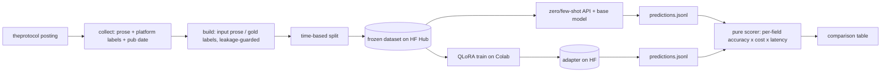

# pl-jobs-lora

**A QLoRA fine-tune of a small Polish LLM that turns Polish IT job-posting prose into structured
JSON — compared honestly against zero-shot / few-shot API baselines on accuracy × cost × latency.**

Portfolio project **P4** (stage 2). Given the free-text of a Polish IT job posting, the model
extracts a structured record — seniority, required/optional technologies, work mode, and salary —
as validated JSON. The dataset is **built from the sibling project [`it-job-radar`](https://github.com/P0w3r223/it-job-radar)**,
labeled with a triangulated QA loop, and every model variant is scored by one shared harness. The
argument the project makes: *a 1.5B model I fine-tuned myself can rival a frontier API on this narrow
task at a fraction of the cost — and here is the measurement.*

> Status: **in progress (session 2 of ~5) — dataset built.** The extraction contract, vendored
> normalization, config/tracking layer, and design decisions are built and tested; the base model is
> **chosen from data** — **Bielik-1.5B, few-shot** (see below); and the **prose→JSON dataset is now
> collected, leakage-guarded, and split by publication date** (see below). Labeling-QA (agreement
> report), API baselines, and the trained adapter land in the next sessions. Evaluation numbers below
> are shown as an **empty shape**, not invented values.

## Why it's built this way

- **Own dataset, not Kaggle.** The training data comes from a pipeline that has been collecting
  Polish IT postings for months — data nobody else has. The model input is the posting *prose*; the
  labels are triangulated from the platform's own structured fields, an LLM reading only the prose,
  and human adjudication of the disagreements. See [ADR-0002](docs/decisions/0002-dataset-and-labeling.md).
- **Honest, apples-to-apples evaluation.** Every variant — zero-shot API, few-shot API, the untuned
  base, the QLoRA model — is scored by the **same pure, model-free harness** on the **same frozen
  test set**, per field. See [ADR-0003](docs/decisions/0003-evaluation-methodology.md).
- **Cost thinking, not just accuracy.** The report answers "per 1000 postings: API $X vs a
  fine-tuned model at ~$0 — at what accuracy?" — the question an employer actually asks.
- **A defensible base-model choice.** Bielik-1.5B vs Qwen2.5-1.5B was decided by an empirical probe,
  not reputation: on a 23-offer dev slice **Bielik-1.5B few-shot** won on JSON-validity × field
  accuracy (0.91 valid, 0.32 field F1) — and zero-shot Bielik emitting *no* valid JSON is exactly
  the gap QLoRA closes. See [ADR-0001](docs/decisions/0001-base-model-selection.md).

## Architecture



The **local `.venv`** builds the dataset, scores predictions, and runs the CPU base-model probe. The
**GPU/Linux training stack** (`transformers`/`peft`/`bitsandbytes`) lives in `requirements-train.txt`
and is installed **only on Colab** — the whole repo (dataset builder, harness, configs) is driven
locally; the Colab notebook only invokes its scripts. See [ADR-0004](docs/decisions/0004-training-infra.md).

## Install & test

```bash
python -m venv .venv
.venv/Scripts/python -m pip install -e ".[dev]"   # Windows; local deps only, no GPU stack
pytest        # offline: no models, no network
ruff check .
```

### Base-model probe (ADR-0001)

Selects the QLoRA base by running both candidates (Qwen2.5-1.5B, Bielik-1.5B) zero- and few-shot
over a live dev slice on **local CPU via GGUF**, scored by the pure harness:

```bash
# CPU llama.cpp: on Windows use the prebuilt wheel (no compiler needed)
.venv/Scripts/python -m pip install llama-cpp-python --prefer-binary \
  --extra-index-url https://abetlen.github.io/llama-cpp-python/whl/cpu

.venv/Scripts/python -m pl_jobs_lora.probe --collect   # fetch slice, then probe both models
.venv/Scripts/python -m pl_jobs_lora.probe             # replay cached slice
```

GGUFs download on demand; the slice, models, and per-run predictions/reports stay local (gitignored).
Both candidates use matched **Q8_0** quantization (Bielik ships no q4). Results land in
`results/probe/`; the decision and numbers are recorded in ADR-0001.

### Dataset build (ADR-0002)

Collects a bounded, throttled, spread sample of theprotocol offers, extracts **prose input** (titled
`jsonSections` only — the technologies widget is dropped as a label leak) + **platform-gold labels** +
publication date, filters the unusable, deduplicates reposts, and splits **by publication date**
(newest 20% → test) — never randomly:

```bash
.venv/Scripts/python -m pl_jobs_lora.dataset.run --collect --limit 20   # smoke: fetch 20, build, split
.venv/Scripts/python -m pl_jobs_lora.dataset.run --collect              # full ~800 collection + freeze
.venv/Scripts/python -m pl_jobs_lora.dataset.run                        # replay cached slice, rebuild
```

The collected slice and processed `data/processed/{train,test}.jsonl` + `manifest.json` stay local
(gitignored); freezing them on HF Hub (`--push`, needs `HF_TOKEN`) is deferred until the dataset repo
is provisioned. Everything downstream replays this frozen dataset — collect once, never re-scrape
(offers expire).

The current build: **800 offers fetched → 710 records** (90 reposts deduplicated by id and prose
hash), split **568 train / 142 test** by publication date. Label coverage: title & work-mode 100%,
seniority 99%, expected-tech 76%, salary 31% (salary is honestly sparse — often absent from the
posting). Zero prose leaks the technologies widget (leakage guard), and train and test share **no
offer id** and **no publication-date overlap** (train ends where test begins).

## Evaluation (shape — populated in later sessions)

| Variant | JSON valid | Seniority F1 | Tech F1 | Work-mode F1 | Salary acc | Median cost | Median latency |
|---|---|---|---|---|---|---|---|
| zero-shot (API) | – | – | – | – | – | – | – |
| few-shot (API) | – | – | – | – | – | – | – |
| base (untuned) | – | – | – | – | – | – | – |
| **QLoRA (ours)** | – | – | – | – | – | – | – |

Metrics normalize both sides through the vendored it-job-radar functions (alias- and
Polish-quirk-aware), so the comparison is fair rather than penalizing paraphrases.

## Data & ethics

Raw postings are **never committed**: prose is captured at collection time (theprotocol postings
expire and the site strips pages for datacenter IPs), the processed dataset is frozen on HF Hub, and
only prose-derived fields leave the machine. Personal data (the `applying` block) is dropped.
Collection is a bounded, throttled sample — never the whole base. Attribution: theprotocol.it, reused
via `it-job-radar`.

## Design decisions

- [ADR-0001 — base-model selection by empirical probe](docs/decisions/0001-base-model-selection.md)
- [ADR-0002 — dataset construction + triangulated labeling QA](docs/decisions/0002-dataset-and-labeling.md)
- [ADR-0003 — per-field metrics with a pure scorer](docs/decisions/0003-evaluation-methodology.md)
- [ADR-0004 — Colab training, hosted MLflow, HF Hub artifacts](docs/decisions/0004-training-infra.md)
- [F6 — data-availability verdict](docs/research/f6-data-availability.md)

## License

MIT — see [LICENSE](LICENSE).
